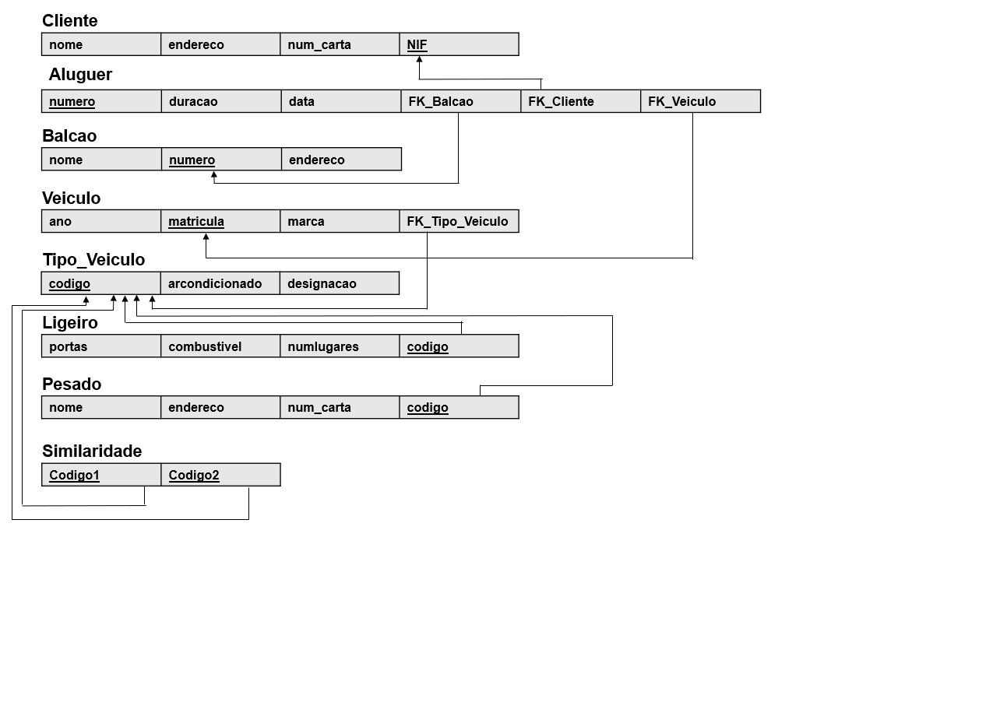
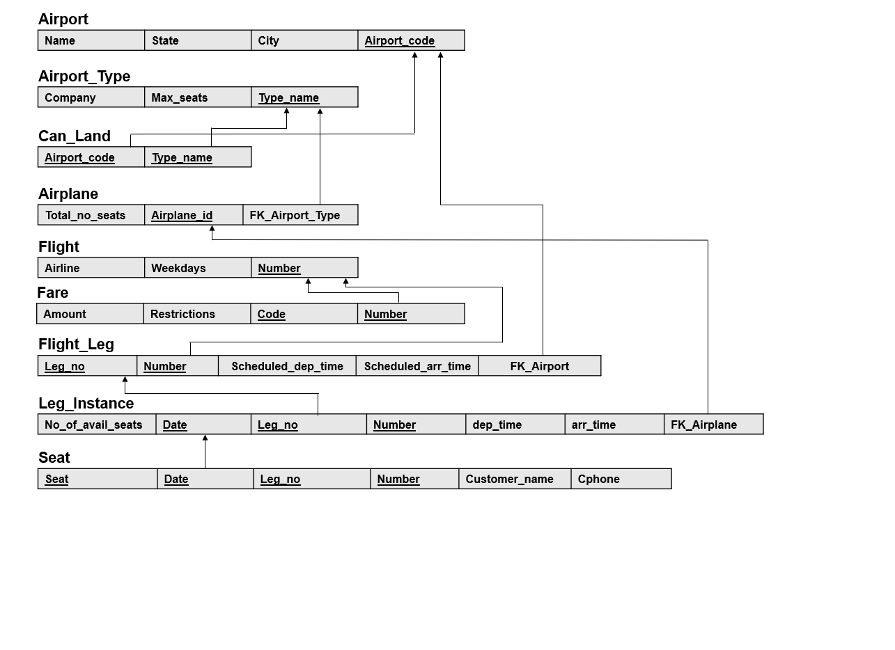
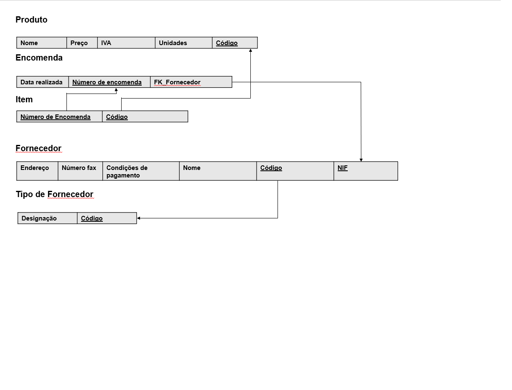
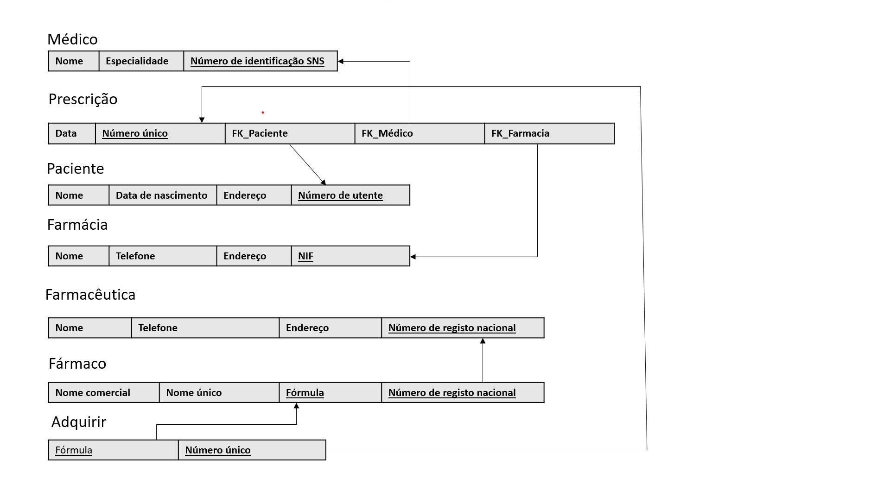
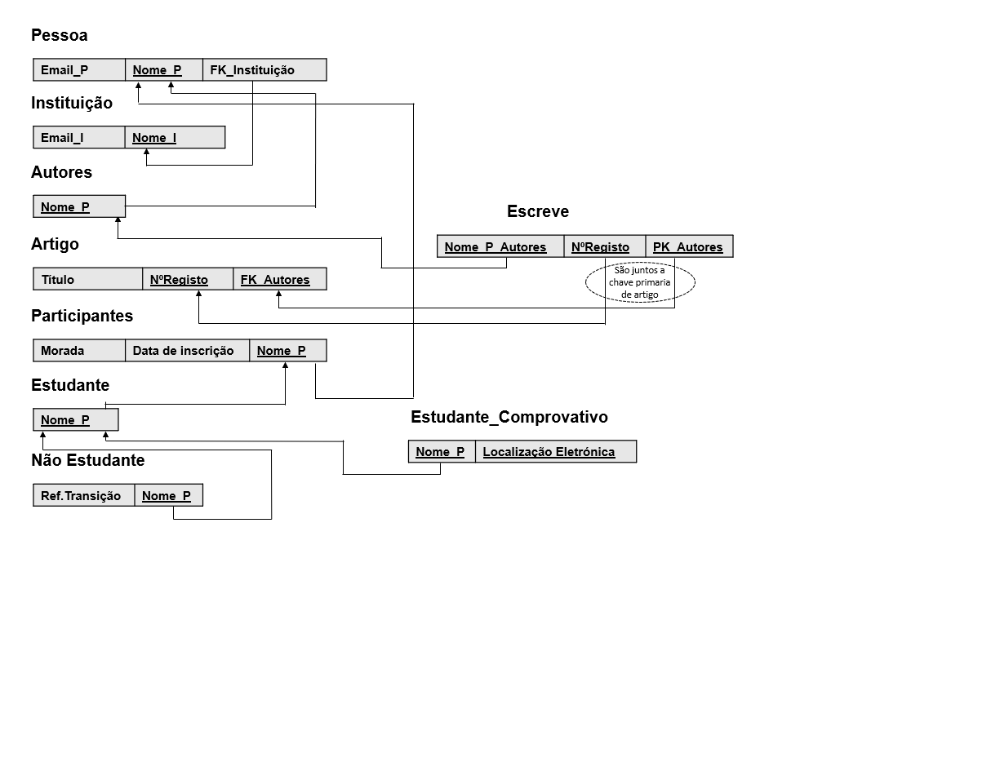
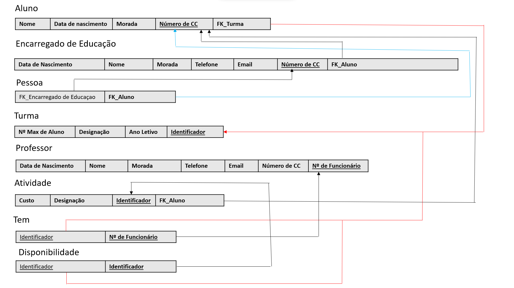

# BD: Guião 3


## ​Problema 3.1
 
### *a)*

```
Cliente(nome,NIF,endereco,num_carta)
Aluguer(numero,duracao,data)
Balcao(nome,numero,endereco)
Veiculo(ano,matricula,marca)
Tipo_Veiculo(codigo,arcondicionado,designacao)
Pesado(peso,passageiros,codigo)
Ligeiro(combustivel,portas,numlugares,codigo)
Similaridade(codigo1,codigo2)
```


### *b)* 

```
Cliente:
    Chaves candidatas:{nome},{NIF},{endereco},{num_carta}
    Chave primaria:{NIF}
    Chaves estrangeiras:NULL

Aluguer:
    Chaves candidatas:{numero},{duracao},{data}
    Chave primaria:{numero}
    Chaves estrangeiras:{FK_Cliente},{FK_Balcao},{FK_Veiculo}

Balcao:
    Chaves candidatas:{nome},{numero},{endereco}
    Chave primaria:{numero}
    Chaves estrangeiras:NULL

Veiculo:
    Chaves candidatas:{ano},{matricula},{marca}
    Chave primaria:{matricula}
    Chaves estrangeiras:{FK_Tipo_Veiculo}

Tipo_Veiculo:
    Chaves candidatas:{codigo},{arcondicionado},{designacao}
    Chave primaria:{codigo}
    Chaves estrangeiras:NULL

Pesado:
    Chaves candidatas:{peso},{passageiros},{codigo}
    Chave primaria:{codigo}
    Chaves estrangeiras:NULL

Ligeiro:
    Chaves candidatas:{combustivel},{portas},{numlugares},{codigo}
    Chave primaria:{codigo}
    Chaves estrangeiras:NULL

Similaridade:
    Chaves candidatas:{codigo1},{codigo2}
    Chaves primarias:{codigo1},{codigo2}
    Chaves estrangeiras:NULL

```


### *c)* 




## ​Problema 3.2

### *a)*

```
Airport(Name,State,City,Airport_code)
Airport_Type(Company,Max_seats,Type_name)
Can_Land(Type_name,Airport_code)
Airplane(Total_no_seats,Airplane_id)
Flight(Airline,Weekdays,Number)
Fare(Amount,Restrictions,Code,Number)
Flight_Leg(Leg_no,Number,Scheduled_dep_time,Scheduled_arr_time)
Leg_Instance(No_of_avail_seats,Date,Leg_no,Number,Dep_time,Arr_time)
Seat(Seat_no,Date,Leg_no,Number,Customer_name,Cphone)

```


### *b)* 

```
Airport:
    Chaves candidatas:{Name},{State},{City},{Airport_code}
    Chave primaria:{Airport_code}
    Chaves estrangeiras:NULL

Airport_Type:
    Chaves candidatas:{Company},{Max_seats},{Type_name}
    Chave primaria:{Type_name}
    Chaves estrangeiras:NULL

Can_Land:
    Chaves candidatas:{{Airport_code},{Type_name}}
    Chave primaria:{{Airport_code},{Type_name}}
    Chaves estrangeiras:{Airport_code},{Type_name}

Airplane:
    Chaves candidatas:{Total_no_seats},{Airplane_id}
    Chave primaria:{Airplane_id}
    Chaves estrangeiras:{FK_Airport_Type}

Flight:
    Chaves candidatas:{Airline},{Weekdays},{Number}
    Chave primaria:{Number}
    Chaves estrangeiras:NULL

Fare:
    Chaves candidatas:{Amount,Number},{Restrictions,Number},{Code,Number}
    Chave primaria:{Code,Number}
    Chaves estrangeiras:{Number}

Flight_Leg:
    Chaves candidatas:{Leg_no,Number}
    Chave primaria:{Leg_no,Number}
    Chaves estrangeiras:{FK_Airport},{Number}

Leg_Instance:
    Chaves candidatas:{Date,Leg_no,Number},{No_of_avail_seats,Leg_no,Number}
    Chave primaria:{Date,Leg_no,Number}
    Chaves estrangeiras:{Leg_no,Number},{FK_Airplane}

Seat:
    Chaves candidatas:{Seat,Date,Leg_no,Number}
    Chave primaria:{Seat,Date,Leg_no,Number}
    Chaves estrangeiras:{Date,Leg_no,Number}

```


### *c)* 




## ​Problema 3.3

### *a)* 2.1



### *b)* 2.2



### *c)* 2.3



### *d)* 2.4


