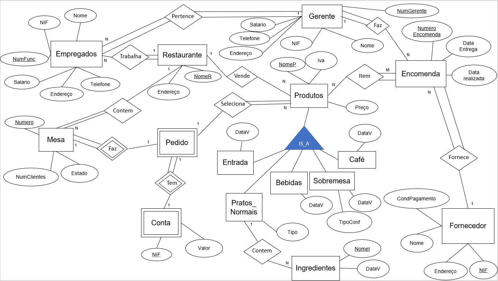
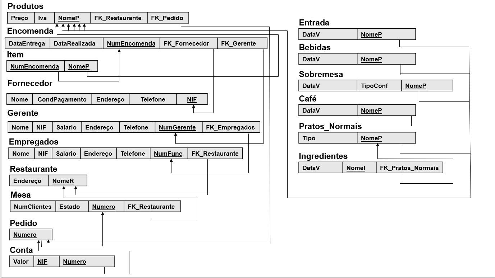

# BD: Trabalho Prático APFE

**Grupo**: P7G3
- Leandro Rito MEC: 92975
- Adalberto Jr. Vaz do Rosário MEC: 105589

## Introdução / Introduction
 
A restauração não é estranha à utilização de sistemas para gerir a sua clientela. No entanto, com base na experiência pessoal de um dos membros deste trabalho, verificou-se a raridade da utilização de sistemas que possam ajudar no manuseamento de inventário, sendo este muitas vezes efetuado através de papel pelos donos do restaurante ou gerentes. Assim, propõe-se a criação de uma base de dados com o objetivo de integrar a tecnologia na gestão do inventário de um restaurante, assim como proporcionar a utilização da mesma para orientação da clientela.

## ​Análise de Requisitos / Requirements
Este sistema de gestão de inventário e transações deverá permitir:
Adicionar e remover informação relativa aos empregados, sendo possível distinguir o gerente dos restantes empregados.
Adicionar e remover informação relativa aos produtos, sendo possível distinguir os vários tipos de produtos.
Adicionar e remover informação relativa à encomenda dos produtos.
Adicionar e remover informação relativa aos fornecedores dos vários produtos.
Adicionar e remover pedidos feitos pelos clientes (listas pertencentes às mesas) utilizando a informação dos produtos previamente adicionados no sistema.
Configurar o estado das mesas. 
Consultar qualquer informação inserida. 
Interpretação dos requisitos:
Empregados que têm nome, número de funcionário, salário, nif, sexo, número de telefone e endereço.
O restaurante tem também um gerente que além de possuir as características de um empregado, também possui um número de gerente.
O restaurante vende diferentes tipos de produtos, sendo estes: entradas, pratos normais, bebidas, sobremesas e café.
As entradas, bebidas, sobremesas e café são caracterizados por nome(marca), data de validade, preço e iva, Além disso, as sobremesas também são identificadas por tipo de confecionamento (caseiras ou não caseiras).
Os pratos normais são identificados por nome, preço, iva, tipo e ingredientes usados, sendo estes ingredientes caracterizados por nome e data de validade.
Tanto os ingredientes como certos produtos possuem diferentes fornecedores, identificados por nome, nif, endereço e condições de pagamento.
Os produtos são fornecidos pelos fornecedores através de encomendas, identificadas por número de encomenda, data em que foi realizada, data de entrega e fornecedor. As encomendas podem conter um ou mais produtos e a quantidade dos mesmos.
As mesas estarão identificadas por número de mesa, número de clientes, estado da mesa (reservado ou não reservado) e pedido, sendo os pedidos caracterizado pelos produtos e conta, posteriormente, a conta é caracterizada por valor e opcionalmente fatura com o contribuinte. 
O Restaurante contém um nome, um endereço, um número de telefone e um gerente.

## DER

## ER

