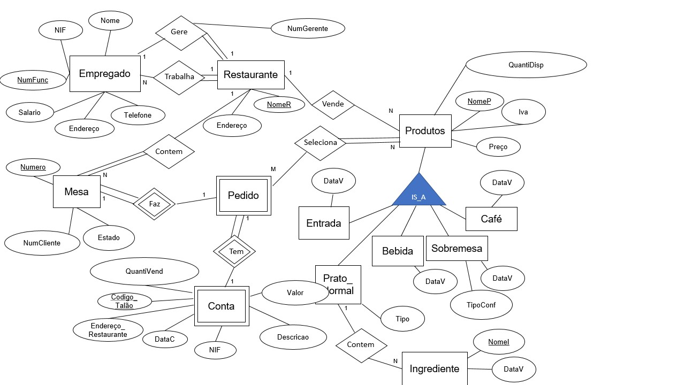
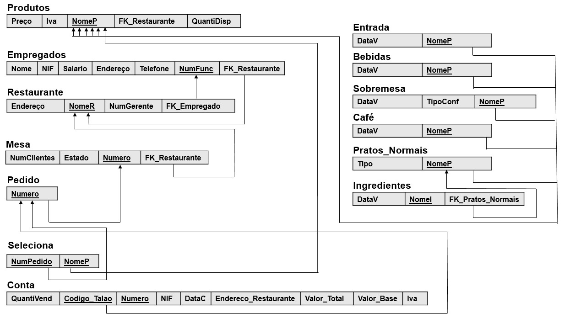

# BD: Trabalho Prático APF-T

**Grupo**: P7G3
- Leandro Rito, MEC: 92975
- Adalberto Jr. Vaz do Rosário, MEC: 105589

## Introdução / Introduction
 
A restauração não é estranha à utilização de sistemas para gerir a sua clientela. No entanto, com base na experiência pessoal de um dos membros deste trabalho, verificou-se a raridade da utilização de sistemas que possam ajudar no manuseamento de inventário, sendo este muitas vezes efetuado através de papel pelos donos do restaurante ou gerentes. Assim, propõe-se a criação de uma base de dados com o objetivo de integrar a tecnologia na gestão do inventário de um restaurante, assim como proporcionar a utilização da mesma para orientação da clientela.

## ​Análise de Requisitos / Requirements

Este sistema de gestão de inventário e transações deverá permitir:
    Adicionar e remover informação relativa aos empregados, sendo possível distinguir o gerente dos restantes empregados.
    Adicionar e remover informação relativa aos produtos, sendo possível distinguir os vários tipos de produtos.
    Adicionar e remover pedidos feitos pelos clientes (listas pertencentes às mesas) utilizando a informação dos produtos previamente adicionados no sistema.
    Configurar o estado das mesas. 
    Consultar qualquer informação inserida.
Na primeira versão era possivel também:  
    Adicionar e remover informação relativa à encomenda dos produtos.
    Adicionar e remover informação relativa aos fornecedores dos vários produtos
Após analisar novamente o problema verificamos não ser necesário esses dois.
## DER - Diagrama Entidade Relacionamento/Entity Relationship Diagram

### Versão final/Final version



### APFE 


Na primeira entrega o nosso diagrama der tinha 15 entidades, para além dos que estão nesta versão também tinhamos uma entidade refernte as encomendas (Encomenda), aos fornecedores (Fornecedor) e o gerente em vez de ser apenas um atributo do Restaurante também era uma entidade (Gerente). Eliminamos as entidades referentes e atualizamos os atributos da entidade Conta.  


## ER - Esquema Relacional/Relational Schema

### Versão final/Final Version



### APFE


Nesta versão apagamos as relaçoes Encomenda, Fornecedor, Gerente e acrescentamos o gerente como um atributo de Restaurante. Criamos uma entidade nomiada Seleciona para ligar o Pedido com o Produto, pois mudamos de relação N:1 para N:M, e acrescentamos mais atributos na relação Conta.


## ​SQL DDL - Data Definition Language

[SQL DDL File](sql/01_ddl.sql "SQLFileQuestion")

## SQL DML - Data Manipulation Language

Uma secção por formulário.
A section for each form.

### Formulario exemplo/Example Form


```sql
-- Show data on the form
SELECT * FROM MY_TABLE ....;

-- Insert new element
INSERT INTO MY_TABLE ....;
```

...

## Normalização/Normalization

Descreva os passos utilizados para minimizar a duplicação de dados / redução de espaço.
Justifique as opções tomadas.
Describe the steps used to minimize data duplication / space reduction.
Justify the choices made.

## Índices/Indexes


Normalmente num restaurante, as consulatas mais feitas são a disponibilidade das mesas os nomes e as quantidade disponíveis dos produtos, por isso nós implementamos indices para facilitar essas consultas. A MesaLivre e o  NomeProduto . 


```sql
-- Create an index to speed
CREATE INDEX MesaLivre ON Mesa (Numero) WHERE Estado = 'Livre'; 

CREATE INDEX NomeProduto ON Produto (Nome,Preco, QuantiDisp);
```

## SQL Programming: Stored Procedures, Triggers, UDF

[SQL SPs and Functions File](sql/03_sp_functions.sql "SQLFileQuestion")

[SQL Triggers File](sql/04_triggers.sql "SQLFileQuestion")

## Outras notas/Other notes

### Dados iniciais da dabase de dados/Database init data

[Indexes File](sql/01_ddl.sql "SQLFileQuestion")

[Indexes File](sql/02_init.sql "SQLFileQuestion")


 