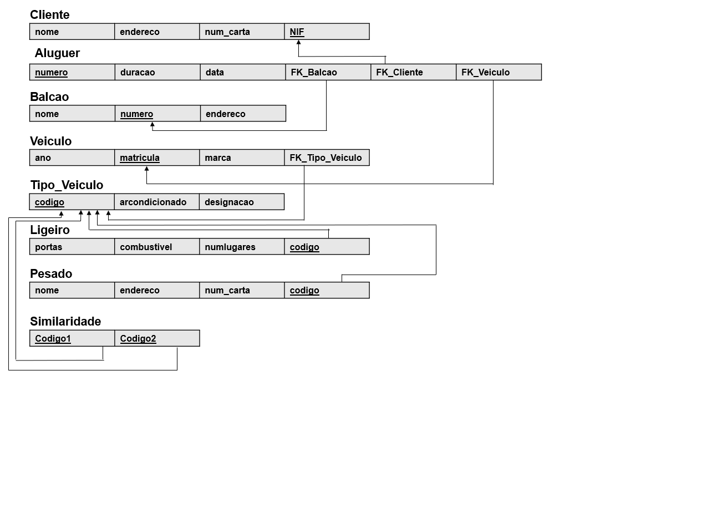
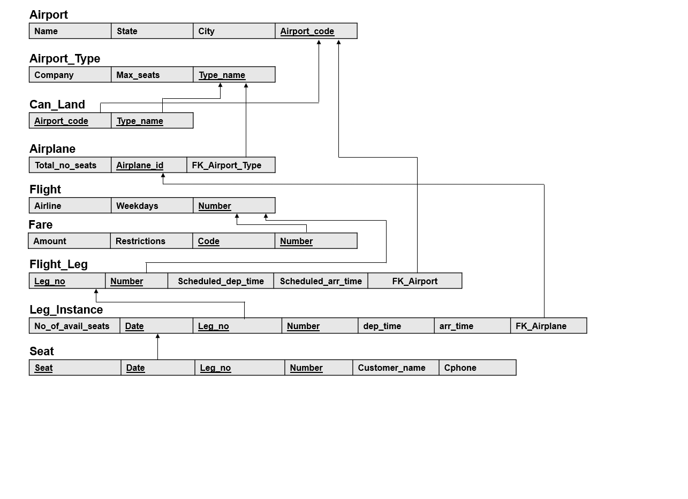

# BD: Guião 3


## ​Problema 3.1
 
### *a)*

```
Cliente(nome,NIF,endereco,num_carta)
Aluguer(numero,duracao,data)
Balcao(nome,numero,endereco)
Veiculo(ano,matricula,marca)
Tipo_Veiculo(codigo,arcondicionado,designacao)
Pesado(peso,passageiros,codigo)
Ligeiro(combustivel,portas,numlugares,codigo)
Similaridade(codigo1,codigo2)
```


### *b)* 

```
Cliente:
    Chaves candidatas:{nome},{NIF},{endereco},{num_carta}
    Chave primaria:{NIF}
    Chaves estrangeiras:NULL

Aluguer:
    Chaves candidatas:{numero},{duracao},{data}
    Chave primaria:{numero}
    Chaves estrangeiras:{FK_Cliente},{FK_Balcao},{FK_Veiculo}

Balcao:
    Chaves candidatas:{nome},{numero},{endereco}
    Chave primaria:{numero}
    Chaves estrangeiras:NULL

Veiculo:
    Chaves candidatas:{ano},{matricula},{marca}
    Chave primaria:{matricula}
    Chaves estrangeiras:{FK_Tipo_Veiculo}

Tipo_Veiculo:
    Chaves candidatas:{codigo},{arcondicionado},{designacao}
    Chave primaria:{codigo}
    Chaves estrangeiras:NULL

Pesado:
    Chaves candidatas:{peso},{passageiros},{codigo}
    Chave primaria:{codigo}
    Chaves estrangeiras:NULL

Ligeiro:
    Chaves candidatas:{combustivel},{portas},{numlugares},{codigo}
    Chave primaria:{codigo}
    Chaves estrangeiras:NULL

Similaridade:
    Chaves candidatas:{codigo1},{codigo2}
    Chaves primarias:{codigo1},{codigo2}
    Chaves estrangeiras:NULL

```


### *c)* 




## ​Problema 3.2

### *a)*

```
Airport(Name,State,City,Airport_code)
Airport_Type(Company,Max_seats,Type_name)
Can_Land(Type_name,Airport_code)
Airplane(Total_no_seats,Airplane_id)
Flight(Airline,Weekdays,Number)
Fare(Amount,Restrictions,Code,Number)
Flight_Leg(Leg_no,Number,Scheduled_dep_time,Scheduled_arr_time)
Leg_Instance(No_of_avail_seats,Date,Leg_no,Number,Dep_time,Arr_time)
Seat(Seat_no,Date,Leg_no,Number,Customer_name,Cphone)

```


### *b)* 

```
Airport:
    Chaves candidatas:{Name},{State},{City},{Airport_code}
    Chave primaria:{Airport_code}
    Chaves estrangeiras:NULL

Airport_Type:
    Chaves candidatas:{Company},{Max_seats},{Type_name}
    Chave primaria:{Type_name}
    Chaves estrangeiras:NULL

Can_Land:
    Chaves candidatas:{{Airport_code},{Type_name}}
    Chave primaria:{{Airport_code},{Type_name}}
    Chaves estrangeiras:{Airport_code},{Type_name}

Airplane:
    Chaves candidatas:{Total_no_seats},{Airplane_id}
    Chave primaria:{Airplane_id}
    Chaves estrangeiras:{FK_Airport_Type}

Flight:
    Chaves candidatas:{Airline},{Weekdays},{Number}
    Chave primaria:{Number}
    Chaves estrangeiras:NULL

Fare:
    Chaves candidatas:{Amount,Number},{Restrictions,Number},{Code,Number}
    Chave primaria:{Code,Number}
    Chaves estrangeiras:{Number}

Flight_Leg:
    Chaves candidatas:{Leg_no,Number}
    Chave primaria:{Leg_no,Number}
    Chaves estrangeiras:{FK_Airport},{Number}

Leg_Instance:
    Chaves candidatas:{Date,Leg_no,Number},{No_of_avail_seats,Leg_no,Number}
    Chave primaria:{Date,Leg_no,Number}
    Chaves estrangeiras:{Leg_no,Number},{FK_Airplane}

Seat:
    Chaves candidatas:{Seat,Date,Leg_no,Number}
    Chave primaria:{Seat,Date,Leg_no,Number}
    Chaves estrangeiras:{Date,Leg_no,Number}

```


### *c)* 




## ​Problema 3.3


### *a)* 2.1
a)
Produto(Código,Nome,*Unidades*,IVA,Preço,)
Encomenda(Número de encomenda,Data realizada)
Fornecedor(Endereço,Número fax,Condições de pagamento,Nome,NIF)
Tipo de Fornecedor(Designação,Código)
### *b)*

Produto:
    Chaves candidatas:{Name},{Código},{Preço},{IVA},{Unidades}
    Chave primaria:{Código}
    Chaves estrangeiras:NULL

Encomenda:
    Chaves candidatas:{Número de encomenda},{Data realizada}
    Chave primaria:{Número de encomenda}
    Chaves estrangeiras:NULL

Fornecedor:
    Chaves candidatas:{Endereço},{Número fax},{Condições de pagamento},{Nome},{NIF}
    Chave primaria:{NIF}
    Chaves estrangeiras:{Código}

Tipo de fornecedor:
    Chaves candidatas:{Designação},{Código}
    Chave primaria:{Código}
    Chaves estrangeiras:NULL


### *b)* 2.2
a)
Médico(Especialidade,Nome,Número de identificação SNS)
Prescrição(Número único,Data)
Paciente(Endereço,Número de utente,Data de Nascimento,Nome)
Farmácia(NIF,Nome,Endereço, Telefone)
Fármaco(Fórmula, Nome comercial, *Nome único*)
Farmacêutica(Nome,Número de registo nacional,Telefone,Endereço)

### *b)*

Médico:
    Chaves candidatas:{Especialidade},{Nome},{Número de identificação SNS}
    Chave primaria:{Número de identificação SNS}
    Chaves estrangeiras:NULL

Prescrição:
    Chaves candidatas:{Número único},{Data}
    Chave primaria:{Número único}
    Chaves estrangeiras:NULL

Paciente:
    Chaves candidatas:{Endereço},{Número utente},{Data de Nascimento},{Nome}
    Chave primaria:{Número de utente}
    Chaves estrangeiras:NULL

Farmácia:
    Chaves candidatas:{NIF},{Nome},{Endereço},{Telefone}
    Chave primaria:{NIF}
    Chaves estrangeiras:NULL


Fármaco:
    Chaves candidatas:{Fórmula},{Nome comercial},{Nome único}
    Chave primaria:{Formula}
    Chaves estrangeiras:{Número de registo nacional}

Farmacêutica:
    Chaves candidatas:{Número de registo nacional},{Nome},{Endereço},{Telefone}
    Chave primaria:{Número de registo nacional}
    Chaves estrangeiras:NULL


### *c)* 2.3
a)
Instituição(Endereço,Nome)
Pessoa(Nome,Email)
Participantes(Morada,Data de inscrição) 
Autores() //...
Artigo(Número de registo, Título)
Estudante(Comprovativo, Localização Electronica)
Não Estudante(Referencia de Transição)

### *b)*

Instituição:
    Chaves candidatas:{Endereço},{Nome}
    Chave primaria:{Nome}
    Chaves estrangeiras:NULL

Pessoa:
    Chaves candidatas:{Nome},{Email}
    Chave primaria:{Email}
    Chaves estrangeiras:NULL

Participantes: 
    Chaves candidatas:{Data de Iscrição},{Morada}
    Chave primaria:{Email}
    Chaves estrangeiras:NULL

Autores:
    Chaves candidatas:{}
    Chave primaria:{Email}
    Chaves estrangeiras:NULL


Artigo:
    Chaves candidatas:{Número de registo},{Título}
    Chave primaria:{Número de registo}
    Chaves estrangeiras:{Email}

Estudante:
    Chaves candidatas:{Comprovativo},{Localização Electronica}
    Chave primaria:{Email}
    Chaves estrangeiras:NULL

Não Estudante:
    Chaves candidatas:{Referencia de Transição}
    Chave primaria:{Email}
    Chaves estrangeiras:NULL


### *d)* 2.4
a)
Aluno(Número de cartão cidadão,Nome, Morada,Data de Nascimento)
Turma(Identificador, Ano Letivo, Designação, Número Max de Aluno)
Encarregado de Educação(Data de Nascimento,Telefone, Número de cartão de cidadão,Nome,Morada,Email)
Pessoas() 
Professor(Número de funcionario, Morada,Email,Nome,Data de nascimento,Número de Cartão de cidadão, Telefone)
Atividade(Custo, Identificador,Designação)

### *b)*

Aluno:
    Chaves candidatas:{Número de cartão de cidadão},{Nome}, {Morada},{Data de Nascimento}
    Chave primaria:{Número de cartão de cidadão}
    Chaves estrangeiras:NULL

Pessoas:
    Chaves candidatas:NULL
    Chave primaria:NULL
    Chaves estrangeiras:NULL

Turma:
    Chaves candidatas:{Identificador}, {Ano Letivo}, {Designação}, {Número Max de Aluno}
    Chave primaria:{Identificador}
    Chaves estrangeiras:NULL

Encarregado de Educação:
    Chaves candidatas:{Data de Nascimento},{Telefone}, {Número de cartão de cidadão},{Nome},{Morada},{Email}
    Chave primaria:{Número de Cartão de Cidadão}
    Chaves estrangeiras:NULL


Professor:
    Chaves candidatas: {Número de funcionario}, {Morada},{Email},{Nome},{Data de nascimento},{Número de Cartão de cidadão}, {Telefone}
    Chave primaria:{Número de funcionario}
    Chaves estrangeiras:NULL

Atividade:
    Chaves candidatas:{Custo}, {Identificador},{Designação}
    Chave primaria:{Identificador}
    Chaves estrangeiras:NULL


